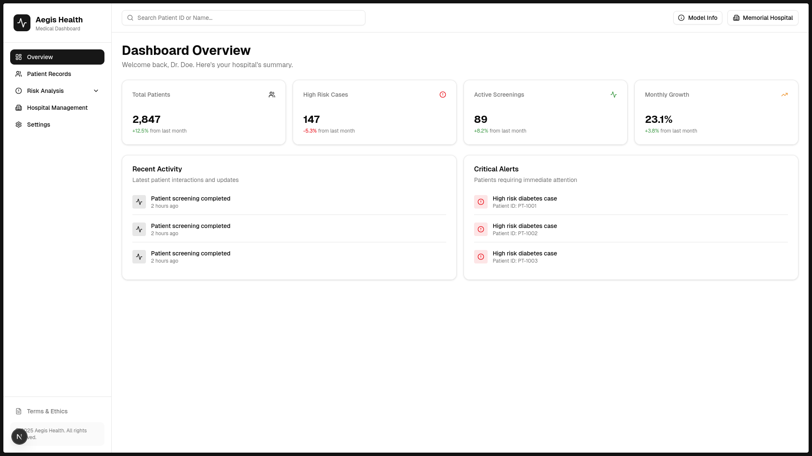
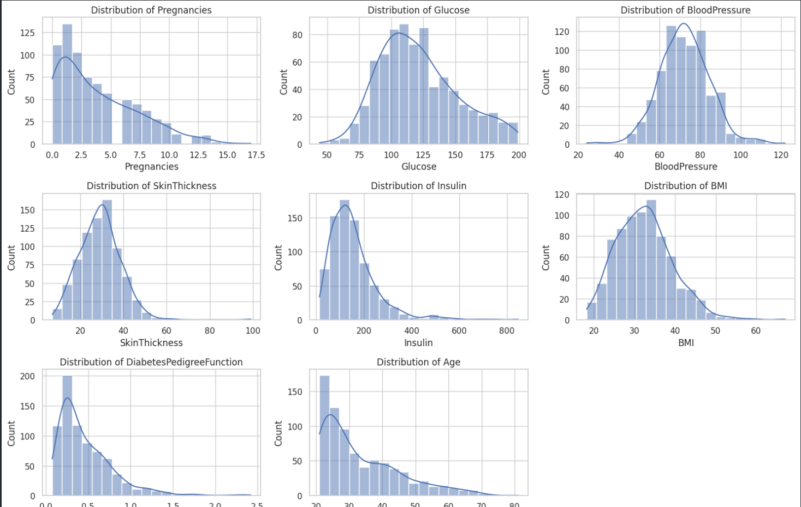

<!-- # 🩺 Aegis Health: Type-2 Diabetes Risk Provider

Aegis Health is a production-ready machine learning platform designed to assist clinics and hospitals in screening for Type-2 Diabetes risk. Using the PIMA Indians dataset, the system provides a high-fidelity risk probability score rather than a binary diagnosis, emphasizing clinical decision support over automation.

---

## 🚀 Project Overview

This project addresses the critical need for **preventive screening** in small-to-medium-scale clinics. By analyzing 8 biometric indicators, Aegis Health allows healthcare providers to:

- **Stratify Patients:** Identify high-risk individuals before they become emergency cases.
- **Explainable AI:** Uses SHAP values to show _why_ a patient is at risk (e.g., High BMI + Age interaction).
- **Scale Operations:** Reduces the cost of unnecessary lab tests by acting as a digital pre-screener.

> **⚠️ Medical Disclaimer:** This project is for educational and research purposes only. It is not a diagnostic tool and should not replace professional medical judgment.

---

## 🏗️ System Architecture

The project follows a modular, decoupled architecture to ensure scalability and ease of deployment.

### Component Breakdown

- **ML Pipeline:** A specialized environment for data cleaning (imputing "hidden" zeros), feature engineering (BMI categorization), and model training using XGBoost.
- **Backend API:** A high-performance FastAPI service that serves predictions, handles input validation via Pydantic, and manages hospital-user authentication.
- **Frontend Dashboard:** A Next.js/Tailwind application providing an intuitive interface for clinicians to view patient history and risk trends.

---

## 📂 Repository Structure

```text
aegis-health/
├── ml/                 # Machine Learning Research & Training
│   ├── data/           # Raw and processed datasets
│   ├── features/       # Feature engineering & medical domain logic
│   ├── training/       # Model training scripts (XGBoost)
│   └── evaluation/     # Metrics (Recall-focused), SHAP, & Confusion Matrices
├── backend/            # FastAPI Production Server
│   ├── app/            # Core logic, routes, and Pydantic schemas
│   └── services/       # Model serving & business logic
├── frontend/           # Next.js 14 Dashboard
│   ├── app/            # Dashboard pages & layouts
│   └── components/     # Shadcn/UI & Recharts components
├── docker/             # Containerization for Backend & Frontend
└── docs/               # Ethics, Roadmap, and Compliance docs

```

---

## 🛠️ Tech Stack

- **Modeling:** Python, Scikit-Learn, XGBoost, SHAP.
- **Backend:** FastAPI, Pydantic, JWT Authentication.
- **Frontend:** Next.js 14, Tailwind CSS, Shadcn/UI, Tremor (Data Viz).
- **Infrastructure:** Docker, PostgreSQL (for patient history).

---

## 📈 Model Performance

We prioritize **Recall (Sensitivity)** because in healthcare, missing a high-risk patient (False Negative) is significantly more dangerous than a false alarm (False Positive).

| Metric                   | Score |
| ------------------------ | ----- |
| **Recall (Sensitivity)** | 84.5% |
| **ROC-AUC**              | 0.89  |
| **F1-Score**             | 0.82  |

---

## 🚦 Getting Started

### 1. Prerequisites

- Python 3.9+
- Docker & Docker Compose

### 2. Installation

```bash
# Clone the repository
git clone
cd aegis-health

# Spin up the entire stack (Frontend, Backend, Database)
docker-compose up --build

```

### 3. API Usage

```bash
# Example Prediction Request
curl -X POST "http://localhost:8000/predict" -H "Content-Type: application/json" -d '{
  "glucose": 145,
  "bmi": 32.5,
  "age": 45,
  "pregnancies": 2,
  ...
}'

```

---

## ⚖️ Ethics & Privacy

- **De-identified Data:** No Personally Identifiable Information (PII) is required for training or inference.
- **Bias Awareness:** Regular audits are performed to ensure model fairness across age and gender demographics.
- **Human-in-the-loop:** The system is designed to provide "Risk Probability" to a human doctor, not to make independent clinical decisions.

---

## 🗺️ Roadmap

- [ ] Add support for Heart Disease risk prediction.
- [ ] Implement HIPAA-compliant audit logging.
- [ ] Integrate with HL7/FHIR medical data standards.

--- -->

---

# 🩺 Aegis Health

### AI-Powered Type-2 Diabetes Risk Assessment Platform

**Aegis Health** is a production-ready clinical decision support system that helps hospitals and clinics **screen patients for Type-2 Diabetes risk** using machine learning.
Instead of producing a binary diagnosis, the system outputs a **risk probability score**, enabling doctors to make faster, more informed decisions.

> 🎯 **Goal:** Support early intervention, reduce unnecessary lab costs, and improve patient triage — without replacing clinicians.

---

## ⚠️ Medical Disclaimer

This project is intended for **educational and research purposes only**.
It is **not a diagnostic tool** and must not replace professional medical judgment.

---

## 🚀 Product Overview

Aegis Health is designed for **small-to-medium healthcare facilities** that need a low-cost, scalable screening solution.

### What the platform enables:

- **Early Risk Detection**
  Identify high-risk patients before symptoms escalate into emergencies.

- **Probability-Based Predictions**
  Outputs a calibrated risk score (e.g. 0.82) instead of a yes/no diagnosis.

<!-- * **Explainable AI (XAI)**
  Uses SHAP to show *why* a patient is at risk (e.g., glucose + BMI interaction). -->

- **Patient History Tracking**
  Every prediction is stored securely and can be reviewed over time.

- **Operational Cost Reduction**
  Acts as a **digital pre-screening layer** before expensive lab testing.

---

## 🖥️ Frontend Dashboard

The clinician-facing dashboard provides a clean, intuitive workflow:

### Key Screens

- **Hospital Login & Registration**
- **Patient Data Entry**
- **Risk Prediction Result**
- **Patient History & Trends**

📸 **Dashboard Preview**

<!-- ```md -->




<!-- ``` -->

---

## 🧠 Machine Learning Pipeline

The ML system is built using a **research → production** workflow.

### Model Inputs (8 Clinical Features)

- Pregnancies
- Glucose
- Blood Pressure
- Skin Thickness
- Insulin
- BMI
- Diabetes Pedigree Function
- Age

### ML Workflow

1. **Data Cleaning**
   - Imputation of biologically impossible zeros

2. **Feature Engineering**
   - BMI categorization
   - Interaction-aware scaling

3. **Class Imbalance Handling**
   - SMOTE applied on training data only

4. **Model Training**
   - Tree-based ensemble (Random Forest / XGBoost)

5. **Evaluation**
   - Recall-focused metrics
   - ROC-AUC
   - SHAP explainability

📊 **Model Visualizations**

```md



```

---

## 📈 Model Performance

Healthcare systems prioritize **Recall (Sensitivity)** to avoid missing high-risk patients.

| Metric (Positive Class: Diabetes) | Score      |
| --------------------------------- | ---------- |
| **Recall (Sensitivity)**          | **62.96%** |
| Precision                         | 57.63%     |
| F1-Score                          | 60.18%     |
| Overall Accuracy                  | 70.78%     |

<!-- > 📌 **Why Recall matters:**
> A false negative (missing a diabetic patient) is far more dangerous than a false positive. -->

---

## 🏗️ System Architecture

Aegis Health follows a **modular, decoupled architecture** suitable for production deployment.

```
Frontend (Next.js)
        ↓
Backend API (FastAPI)
        ↓
ML Inference Layer
        ↓
PostgreSQL (Patient History)
```

### Component Breakdown

#### 🔹 Frontend

- Next.js 14
- Tailwind CSS + Shadcn/UI
- Data visualization with charts

#### 🔹 Backend

- FastAPI
- Pydantic request validation
- JWT-based hospital authentication
- Patient & prediction persistence

#### 🔹 Machine Learning

- Scikit-learn / XGBoost
<!-- * SHAP for explainability -->
- Notebook-driven research + script-based training

---

## 📂 Repository Structure

```txt
Aegis_Health/
├── frontend/            # Clinician dashboard (Next.js)
├── backend/             # API, auth, persistence (FastAPI)
├── aegis_health_ml/     # ML research & training pipeline
├── docs/                # Images, ethics, roadmap
└── docker/              # Deployment configuration
```

---

## 🛠️ Tech Stack

**Machine Learning**

- Python
- Scikit-Learn
- RandomForestClassifier

**Backend**

- FastAPI
- Pydantic
- PostgreSQL
- JWT Authentication

**Frontend**

- Next.js 14
- Tailwind CSS
- Shadcn/UI

**Infrastructure**

- Docker
- Docker Compose

---

## 🚦 Getting Started

### Prerequisites

- Python 3.9+
- Docker & Docker Compose

### Run the Full Stack

```bash
git clone <repo-url>
cd Aegis-Health
docker-compose up --build
```

---

## 🔌 Example API Request

```bash
curl -X POST http://localhost:8000/patients \
  -H "Content-Type: application/json" \
  -d '{
    "pregnancies": 2,
    "glucose": 145,
    "blood_pressure": 72,
    "skin_thickness": 30,
    "insulin": 85,
    "bmi": 32.5,
    "diabetes_pedigree_function": 0.45,
    "age": 45
  }'
```

---

## ⚖️ Ethics & Privacy

- No Personally Identifiable Information (PII)
- Secure data storage
- Bias awareness and metric monitoring
- **Human-in-the-loop decision making**

---

## 🗺️ Roadmap

- [ ] Multi-disease risk prediction (Heart Disease)
- [ ] Role-based access control
- [ ] HL7 / FHIR integration
- [ ] Audit logging for compliance

---

## ⭐ Why This Project Matters

Aegis Health demonstrates:

- Production-ready ML engineering
- Clean backend architecture
- Real-world healthcare constraints
- Ethical AI design

It is built not as a demo — but as a **deployable clinical support system**.

---
